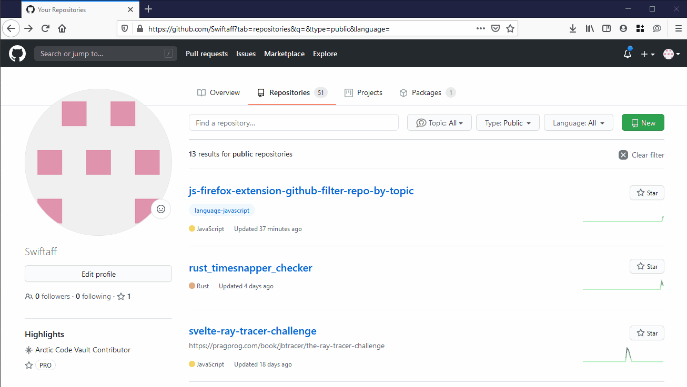

# Github Filter Repo By Topic Button Extension

[Github filter repo by Topic](https://addons.mozilla.org/en-US/firefox/addon/github-filter-repo-by-topic/)
helps you quickly find your related Github repositories grouped by Topic!

This extension adds a "Topic" button to your Github repository page.
Yes, you can already use the "topic:html" syntax to search for a topic, but who can remember all the topics you might have used in the past?

Instead, this Topic button aggregates all the topics found on this page - and hovering over them will automatically filter the list, so you can quickly find your related repositories!

## License

This project is licensed under the MIT License - see [LICENSE](LICENSE) file for details
